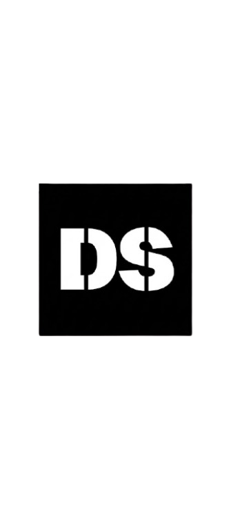
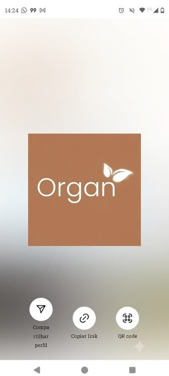

Quero fazer DUAS correções no projeto atual, mas sem alterar o layout, identidade visual ou estrutura das seções existentes.

IMPORTANTE:

* NÃO redesenhe o site.
* NÃO altere cores, fontes, espaçamentos, tamanhos das seções, cards, botões ou animações existentes.
* NÃO altere o layout do portfólio.
* NÃO substitua componentes por outros.
* Faça somente as alterações necessárias para os dois problemas abaixo.
* Antes de editar, analise os arquivos envolvidos e explique brevemente o que será alterado.
* Depois, informe exatamente quais arquivos foram modificados.

## 1. Logos da seção "Marcas"

Na seção "Marcas", os logos estão dentro do efeito de rolagem horizontal/marquee:

```html
<div class="brands-marquee">
  <div class="brands-track">
    
    
    
    
    
    
  </div>
</div>
```

Quero corrigir APENAS a apresentação dos logos.

Objetivos:

* Fazer os logos terem uma proporção visual mais equilibrada entre si.
* Evitar que um logo fique muito maior ou menor que os outros.
* Preservar a proporção original de cada imagem.
* NÃO deformar nenhum logo.
* NÃO cortar os logos.
* Usar `object-fit: contain` quando apropriado.
* Definir uma altura visual consistente para os logos, permitindo que a largura seja automática.
* Manter o efeito de rolagem horizontal/marquee exatamente como já funciona.
* Manter o espaçamento atual o mais próximo possível.
* Criar ajuste responsivo apenas se for necessário para evitar logos exageradamente grandes no celular.
* NÃO alterar a estrutura da seção "Marcas".

Se necessário, ajuste somente o CSS relacionado a:
`.brands-marquee`
`.brands-track`
`.brands-track img`

Não altere outras partes do layout.

## 2. Melhorar muito o carregamento das imagens e principalmente dos vídeos

O problema atual é que, ao navegar pela página, os vídeos do portfólio demoram para aparecer e a página acaba acessando muitos arquivos de vídeo mesmo quando o usuário ainda não chegou naquela parte.

Analise principalmente `script.js`, `index.html` e o CSS relacionado aos cards.

Atualmente o `renderPortfolio()` cria os vídeos aproximadamente assim:

```html
<video
  class="portfolio-card-video"
  src="${item.video}"
  muted
  playsinline
  preload="metadata">
</video>
```

Existem aproximadamente 29 vídeos no portfólio.

Quero implementar LAZY LOADING REAL para os vídeos.

### Requisito principal

Não colocar o caminho do vídeo diretamente em `src` quando todos os cards são criados.

Em vez disso, utilizar uma abordagem semelhante a:

```html
<video
  class="portfolio-card-video"
  data-video="${item.video}"
  muted
  playsinline
  preload="none">
</video>
```

Depois, criar um `IntersectionObserver` específico para mídia.

Esse observer deve:

* Detectar quando um vídeo estiver próximo de entrar na área visível.
* Só então copiar `data-video` para `src`.
* Executar `video.load()`.
* Carregar somente os vídeos necessários.
* Parar de observar o vídeo depois que ele for carregado.
* Usar uma margem antecipada razoável, por exemplo aproximadamente `300px`, para que o vídeo comece a carregar um pouco antes de aparecer na tela.

IMPORTANTE:
O `IntersectionObserver` existente usado para as animações `.reveal` NÃO deve ser confundido com o lazy loading de mídia.

Pode criar um observer separado exclusivamente para os vídeos.

### Modal dos vídeos

A lógica atual do modal deve continuar funcionando.

Quando o usuário clicar em um card e abrir o vídeo:

* O vídeo completo deve continuar sendo carregado no modal.
* `openVideoModal()` deve continuar funcionando.
* `closeVideoModal()` deve continuar liberando o `src` quando apropriado.
* Não remover nenhuma funcionalidade existente do modal.
* Não alterar o visual do modal.

### Fotos

As fotos já utilizam `loading="lazy"`.

Mantenha esse comportamento.

Se for seguro e não alterar o layout, pode adicionar:

```html
decoding="async"
```

às imagens carregadas dinamicamente.

Faça o mesmo para as imagens da seção de equipamentos se isso fizer sentido.

Não implemente mudanças desnecessárias.

### Arquivos de mídia

Verifique também a pasta `videos/` e confirme se existem arquivos com extensões suspeitas, especialmente referências como:

```text
video12.mp
video8.mp
```

NÃO renomeie arquivos automaticamente.

Primeiro verifique se esses arquivos realmente existem e se existe uma versão `.mp4` correspondente.

Se for apenas um erro de referência no JavaScript e o arquivo `.mp4` correspondente existir, corrija a referência.

Se não houver certeza, não altere.

### Regra mais importante

Preserve completamente:

* layout atual;
* identidade visual;
* animações;
* filtros do portfólio;
* funcionamento do modal;
* navegação;
* responsividade;
* textos;
* cards;
* ordem das seções.

As únicas mudanças desejadas são:

1. Melhorar visualmente o tamanho/proporção dos logos da seção "Marcas".
2. Fazer lazy loading real dos vídeos e otimizar o carregamento das imagens sem mudar o visual do site.

Antes de finalizar:

* Verifique se não existem erros no JavaScript.
* Verifique se os filtros do portfólio continuam funcionando.
* Verifique se o modal dos vídeos continua funcionando.
* Verifique se o marquee das marcas continua funcionando.
* Não faça alterações fora do escopo.

No final, me mostre um resumo objetivo:

1. arquivos modificados;
2. o que foi alterado em cada arquivo;
3. como o carregamento dos vídeos ficou mais eficiente;
4. se alguma referência de arquivo de mídia estava incorreta.


-----------------------------------------------------------------------------------------------------------------------------------------
PROMPT 2 
Adicione uma nova seção chamada **"Investimentos"** imediatamente antes da seção **"Contato"** do projeto.

IMPORTANTE:

* Não altere o layout das outras seções.
* Não altere a identidade visual existente do site.
* Não crie uma cópia do print de referência.
* Use o conteúdo abaixo apenas como referência para estruturar os textos e informações da seção.
* A seção deve ser responsiva e seguir a estilização já existente no Portifolio-Dani.

### SEÇÃO: INVESTIMENTOS

A seção deve apresentar os pacotes de serviços UGC disponíveis para contratação.

Antes dos pacotes, destacar a informação:

**Todos os pacotes estão incluídos:**

* Triagem
* Roteiro
* Gravação
* Edição
* Stories
* Formato criativo e nativo

### PACOTE 1

**R$ 350,00**

Inclui:

* 1 vídeo
* 2 fotos
* 1 story
* Uso em ads/sites/marketplace por 2 meses
* Demais redes: vitalício

### PACOTE 2

**R$ 557,00**

Inclui:

* 2 vídeos
* 5 fotos
* 1 story
* Uso em ads/sites/marketplace por 4 meses
* Demais redes: vitalício

### PACOTE 3

**R$ 947,00**

Inclui:

* 3 vídeos
* 10 fotos
* 2 stories
* Uso em ads/sites/marketplace por 6 meses
* Demais redes: vitalício

### CONTEÚDOS UGC

Adicionar também um bloco explicando o processo de produção:

**Alinhamento inicial:** Após o interesse mútuo, o contrato é enviado e assinado. A empresa escolhe e envia os produtos.

**Produção:** Com os produtos em mãos, o roteiro é entregue em até 3 dias úteis para aprovação. O conteúdo final é gravado e editado em alta qualidade e entregue em até 7 dias úteis.

**Distribuição:** Os conteúdos podem ser utilizados em ads, redes sociais, marketplaces, sites e outros canais, conforme o período de uso contratado.

### CHAMADA PARA AÇÃO

No final da seção, adicionar uma chamada incentivando o visitante a entrar em contato para contratar um pacote ou tirar dúvidas.

O botão deve direcionar para a seção **Contato**, onde o usuário poderá enviar uma mensagem para a criadora.

Exemplo de texto:

**"Vamos criar conteúdos que conectam sua marca ao seu público?"**

Botão:

**"Falar sobre meu projeto"**

A seção deve ficar posicionada entre a seção de serviços/portfólio existente e a seção de contato.

